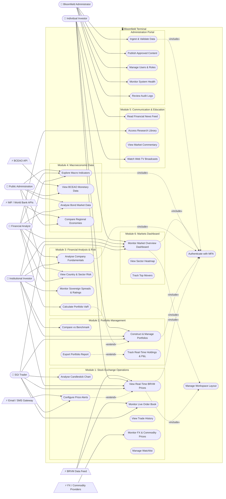
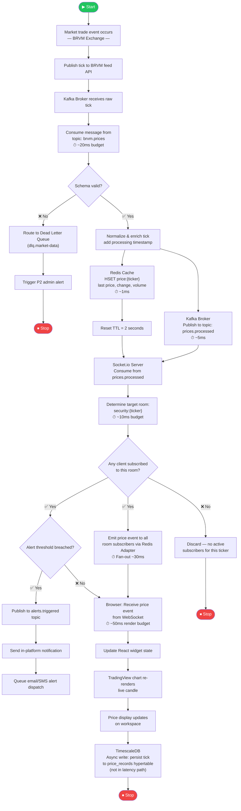
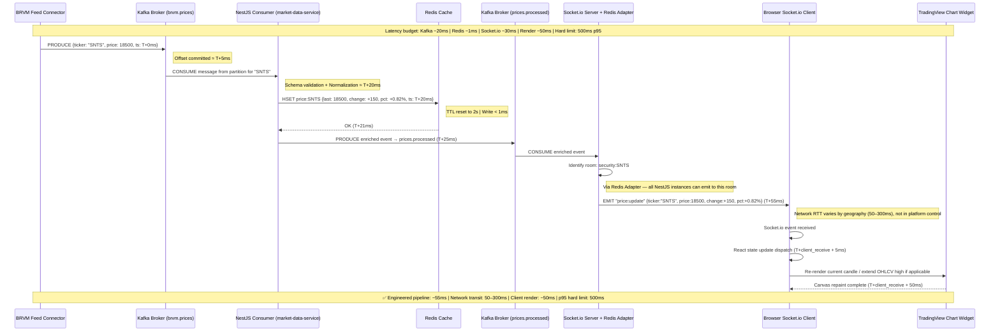
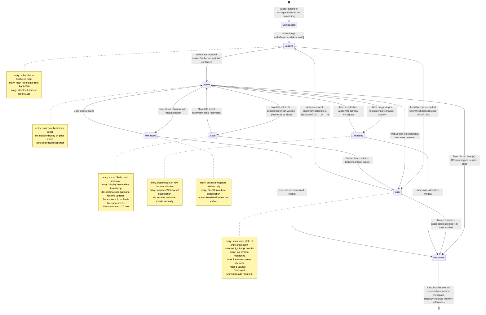
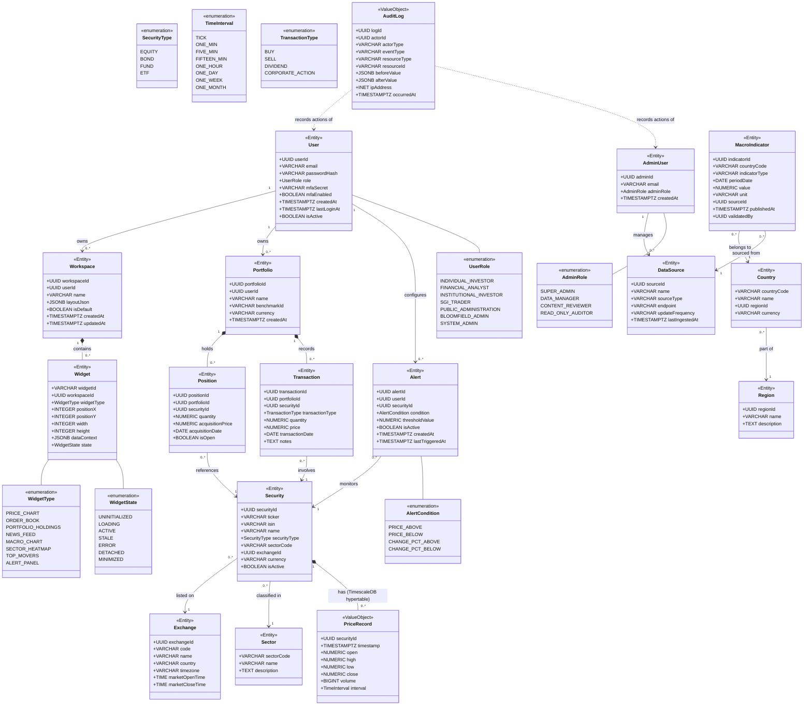
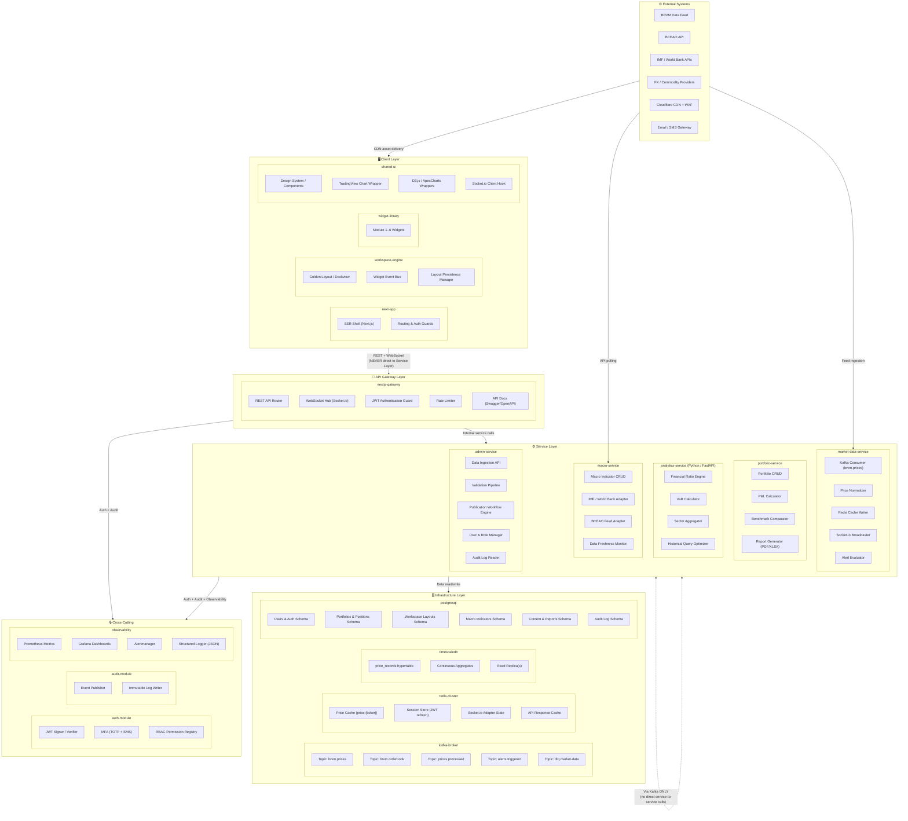

# SOFTWARE REQUIREMENTS SPECIFICATION
## Bloomfield Terminal
### Professional Financial Data Platform for African Markets

---

| Field | Value |
|---|---|
| Document Reference | SRS-BI-2026-001 |
| RFP Reference | AO_BI_2026_001 |
| Version | 1.0 |
| Status | Draft — Awaiting Bloomfield Intelligence Validation |
| Date | February 2026 |
| Issuer | Bloomfield Intelligence, Abidjan, Côte d'Ivoire |
| Classification | Confidential — NDA Required |
| Document Owner | Bloomfield Intelligence — Project Director |

---

**Revision History**

| Version | Date | Author | Description |
|---|---|---|---|
| 0.1 | Feb 2026 | Architecture Team | Initial draft |
| 1.0 | Feb 2026 | Architecture Team | First complete version for review |

---

## TABLE OF CONTENTS

1. Introduction
   - 1.1 Purpose
   - 1.2 Scope
   - 1.3 Definitions and Acronyms
   - 1.4 Document Conventions
   - 1.5 References

2. Overall Description
   - 2.1 Product Perspective
   - 2.2 User Classes and Characteristics
   - 2.3 Operating Environment
   - 2.4 Design and Implementation Constraints
   - 2.5 Assumptions and Dependencies

3. Functional Requirements
   - 3.1 Module 1 — Integrated Management of Stock Exchange Operations
   - 3.2 Module 2 — Portfolio Management
   - 3.3 Module 3 — Financial Analysis and Risk
   - 3.4 Module 4 — Macroeconomic Data
   - 3.5 Module 5 — Communication and Education
   - 3.6 Module 6 — Markets Dashboard

4. External Interface Requirements
   - 4.1 Modular Multi-Screen Workspace Architecture
   - 4.2 Data Ingestion Interfaces
   - 4.3 Export Interfaces

5. System Features — Real-Time Streaming Strategy
   - 5.1 Data Classification and Latency Targets
   - 5.2 Real-Time Pipeline Architecture
   - 5.3 WebSocket Implementation
   - 5.4 Redis Caching Strategy
   - 5.5 Kafka Configuration

6. Non-Functional Requirements
   - 6.1 Performance
   - 6.2 Scalability
   - 6.3 Availability and Business Continuity
   - 6.4 Security
   - 6.5 Compliance

7. Data Governance
   - 7.1 Governance Principle
   - 7.2 Secure Administration Interface
   - 7.3 Data Validation Workflow
   - 7.4 Traceability Requirements
   - 7.5 Access Segregation

8. Deliverables Specification

9. Maintenance and Support Requirements

10. UML Diagrams
    - B1 — Use Case Diagram
    - B2 — Activity Diagram: Real-Time Data Ingestion Pipeline
    - B3 — Sequence Diagram: Authentication and Workspace Load
    - B4 — Sequence Diagram: Real-Time Price Update to Widget
    - B5 — State Machine Diagram: Widget Lifecycle
    - S1 — Class Diagram: Core Domain Model
    - S2 — Package Diagram: System Architecture

---

---

# 1. INTRODUCTION

## 1.1 Purpose

This Software Requirements Specification (SRS) defines, in complete and unambiguous terms, all functional and non-functional requirements for the Bloomfield Terminal — a professional-grade financial data platform designed for institutional actors operating in African markets, with primary focus on the UEMOA economic zone and the Bourse Régionale des Valeurs Mobilières (BRVM).

This document serves simultaneously as:

- The technical reference for the selected service provider's development team
- The acceptance baseline for Bloomfield Intelligence's project governance board
- The test specification anchor for the QA team
- The contractual scope boundary for the procurement process initiated under RFP AO_BI_2026_001

This document supersedes all prior verbal, email, or informal communications regarding platform requirements. Any requirement not captured in this SRS is considered out of scope for Version 1.0 of the Bloomfield Terminal.

## 1.2 Scope

### In Scope — Version 1.0

The Bloomfield Terminal Version 1.0 encompasses the design, development, deployment, and maintenance of a browser-based professional financial workspace comprising six sequentially delivered functional modules:

- Module 1: Integrated Management of Stock Exchange Operations
- Module 2: Portfolio Management
- Module 3: Financial Analysis and Risk
- Module 4: Macroeconomic Data
- Module 5: Communication and Education
- Module 6: Markets Dashboard

The platform includes a modular floating workspace engine (multi-window, drag-resize-detach paradigm), real-time BRVM market data streaming with sub-500ms latency, historical time-series data spanning 10+ years, a secure Bloomfield Intelligence administration interface, and three fully isolated deployment environments (Development, Test-Acceptance, Production).

### Explicitly Out of Scope — Version 1.0

The following capabilities are excluded from this version and must not be designed in ways that make their future addition impossible, but they are not deliverables of this contract:

- Direct order placement or execution routing to BRVM brokers
- Mobile native applications (iOS or Android)
- Algorithmic trading or automated strategy execution
- Integration with non-UEMOA exchanges beyond reference/benchmark data
- White-label licensing to third-party institutions
- AI/ML-powered predictive analytics (deferred to a future release)
- Multi-language support beyond French and English

## 1.3 Definitions and Acronyms

| Term | Definition |
|---|---|
| BRVM | Bourse Régionale des Valeurs Mobilières — the regional stock exchange of the West African Economic and Monetary Union (WAEMU/UEMOA), headquartered in Abidjan |
| UEMOA | Union Économique et Monétaire Ouest-Africaine — the West African Economic and Monetary Union comprising eight member states: Benin, Burkina Faso, Côte d'Ivoire, Guinea-Bissau, Mali, Niger, Senegal, Togo |
| SGI | Société de Gestion et d'Intermédiation — a licensed securities management and intermediation company operating under UEMOA financial market regulations |
| BCEAO | Banque Centrale des États de l'Afrique de l'Ouest — the central bank of UEMOA, responsible for monetary policy and financial market regulation |
| WebSocket | A full-duplex communication protocol providing persistent, low-latency bidirectional channels over a single TCP connection between client and server |
| SSE | Server-Sent Events — a unidirectional server-to-client HTTP streaming protocol used as a fallback to WebSocket |
| TimescaleDB | An open-source time-series database built as a PostgreSQL extension, optimized for high-throughput ingestion and fast querying of time-stamped financial data |
| Kafka | Apache Kafka — a distributed event streaming platform used as the message broker for high-throughput ingestion and fan-out of market data events |
| Redis | An in-memory data structure store used as a distributed cache layer for sub-millisecond price serving and cross-server WebSocket session synchronization |
| Widget | A self-contained, interactive UI panel within the workspace canvas that displays a specific data view (e.g., live price chart, order book, portfolio holdings) |
| Workspace | The user's personalized canvas composed of arranged widgets; layouts are persisted per user profile in PostgreSQL |
| Latency | The elapsed time between a market event occurring at the source (BRVM) and the updated data being rendered on the user's screen |
| Throughput | The volume of data events processed per unit of time, typically measured in messages per second for the Kafka pipeline |
| P1 Incident | Critical severity — platform is fully unavailable, data breach in progress, or real-time feed is completely down. Requires immediate response |
| P2 Incident | Major severity — a primary module is unavailable or performance is severely degraded for a significant user population |
| P3 Incident | Minor severity — a non-critical feature is broken, a UI defect is present, or performance is marginally below target for a subset of users |
| SLA | Service Level Agreement — the contractual commitment to platform availability, performance, and support response times |
| RTO | Recovery Time Objective — the maximum acceptable duration of platform unavailability following a failure event |
| RPO | Recovery Point Objective — the maximum acceptable data loss window, measured as the age of the most recent restorable backup |
| ADR | Architecture Decision Record — a structured document capturing the context, decision, and consequences of a significant architectural choice |
| JWT | JSON Web Token — a compact, cryptographically signed token used for stateless authentication between client and server |
| MFA | Multi-Factor Authentication — an authentication mechanism requiring users to verify their identity through two or more independent factors |
| RBAC | Role-Based Access Control — an authorization model in which access permissions are assigned to roles, and roles are assigned to users |
| OHLCV | Open, High, Low, Close, Volume — the standard data format for financial candlestick charts representing price action over a time interval |
| VaR | Value at Risk — a statistical measure of the potential loss in a portfolio over a defined time horizon at a given confidence level |
| WAF | Web Application Firewall — a security layer that filters and monitors HTTP traffic between the internet and the application server |
| CDN | Content Delivery Network — a geographically distributed network of servers that delivers static assets to users from the nearest point of presence |
| SSR | Server-Side Rendering — a Next.js capability that pre-renders page HTML on the server before delivery to the browser, improving initial load performance |
| p95 | 95th percentile — a performance measurement indicating that 95% of measured operations complete within the stated duration |
| TLS | Transport Layer Security — a cryptographic protocol securing data in transit between client and server |
| AES-256 | Advanced Encryption Standard with 256-bit keys — the encryption standard applied to data at rest |

## 1.4 Document Conventions

### Requirement Identifier Format

All requirements in this document are assigned unique identifiers following this schema:

- **Functional Requirements:** `FR-MOD[n]-[NNN]` where `[n]` is the module number (1–6) and `[NNN]` is a zero-padded sequential number (001, 002, …)
- **Non-Functional Requirements:** `NFR-[CAT]-[NNN]` where `[CAT]` is a category code (PERF, SCALE, AVAIL, SEC, COMP) and `[NNN]` is sequential
- **Data Governance Requirements:** `DGR-[NNN]`
- **Interface Requirements:** `IR-[NNN]`

### Priority Classification (RFC 2119)

All requirements are tagged with one of three priority levels:

| Tag | Meaning |
|---|---|
| **MUST** | Absolute requirement. Non-compliance constitutes a contract breach. The platform MUST NOT be accepted without fulfilling all MUST requirements |
| **SHOULD** | Strong recommendation. Deviation requires documented justification and written approval from Bloomfield Intelligence |
| **MAY** | Optional capability. Inclusion is at the service provider's discretion within the contracted budget and timeline |

### Testability Standard

Every MUST and SHOULD requirement must be accompanied by an acceptance criterion that is objectively verifiable without subjective judgment. Acceptance criteria are prefixed with **AC:** in the requirement definition.

## 1.5 References

| Reference | Description |
|---|---|
| AO_BI_2026_001 | Bloomfield Intelligence Request for Proposals — Development of a Professional Economic and Financial Web Platform, Version 2.0, February 2026 |
| RFC 2119 | Key words for use in RFCs to Indicate Requirement Levels (Bradner, 1997) |
| GDPR Article 25 | EU General Data Protection Regulation — Data Protection by Design and by Default |
| BCEAO Instruction 001-01-2017 | BCEAO regulatory framework governing financial data dissemination within the UEMOA zone |
| ISO/IEC 25010:2011 | Systems and software quality models — reference standard for non-functional quality characteristics |
| OWASP Top 10 (2021) | Open Web Application Security Project — reference for web application security vulnerability classification |
| IEEE Std 830-1998 | IEEE Recommended Practice for Software Requirements Specifications — structural reference for this document |

---

# 2. OVERALL DESCRIPTION

## 2.1 Product Perspective

The Bloomfield Terminal addresses a structural gap in the African financial intelligence market. Existing professional terminals — Bloomberg Terminal, Refinitiv Eikon — are designed for globally diversified institutional markets and carry price points ($20,000–$30,000 per seat per year) that are prohibitive for the majority of UEMOA-based institutions. Their data coverage of African markets is shallow, their normalization frameworks do not account for UEMOA-specific instruments, and they offer no integrated cross-referencing of BRVM data with BCEAO monetary policy or regional macroeconomic indicators.

Generic business intelligence dashboards (Tableau, Power BI, Grafana) offer flexible data visualization but impose heavy data engineering prerequisites, carry no native financial market data integration, and provide no investment lifecycle workflow support.

The Bloomfield Terminal occupies the white space between these two extremes: a purpose-built, institutionally rigorous, Africa-first financial intelligence platform. Its architecture mirrors the professional terminal paradigm — modular floating workspace, real-time market data, multi-layered analytical depth — while its data model is built from the ground up around UEMOA market structure, BCEAO regulatory frameworks, and the investment workflows of West African institutional actors.

The platform is a standalone web application. It does not depend on, extend, or integrate with any existing Bloomfield Intelligence software system in Version 1.0, though its API-first design mandates future interoperability.

### System Context Diagram

The Bloomfield Terminal sits at the center of the following external system relationships:

| External System | Relationship | Direction |
|---|---|---|
| BRVM Data Feed | Real-time price, order book, trade data | Inbound |
| BCEAO API | Key rates, monetary policy data | Inbound |
| IMF / World Bank APIs | Macroeconomic indicators | Inbound |
| FX Data Provider | Exchange rate feeds | Inbound |
| Commodity Price Provider | Strategic commodity prices | Inbound |
| Cloudflare CDN | Static asset delivery, WAF, DDoS protection | Bidirectional |
| Email/SMS Gateway | MFA codes, user alerts | Outbound |
| User Browser (Desktop) | Primary client interface | Bidirectional |
| User Browser (Mobile) | Secondary client interface | Bidirectional |

## 2.2 User Classes and Characteristics

The platform serves six distinct user classes, each with differentiated access rights, workflow needs, and technical proficiency levels. The platform MUST support role-based access control that maps precisely to these profiles.

### 2.2.1 Institutional Investor

**Profile:** Fund managers, insurance companies, pension funds, development finance institutions operating within the UEMOA zone.

**Workflow needs:** Macroeconomic cross-referencing for asset allocation decisions; sovereign spread analysis to assess country risk relative to portfolio composition; portfolio-level performance benchmarked against BRVM indices; fundamental analysis of listed companies; export of structured data for internal reporting systems.

**Technical proficiency:** High. Users are comfortable with complex multi-panel interfaces and financial data formats.

**Access rights:** Modules 1 (read-only), 2 (full), 3 (full), 4 (full), 5 (read-only), 6 (full).

**Session characteristics:** Extended sessions (4–8 hours), heavy use of historical data queries and portfolio views, moderate real-time data consumption.

### 2.2.2 SGI Trader / Chief Trader

**Profile:** Licensed traders and chief traders at Sociétés de Gestion et d'Intermédiation operating on the BRVM.

**Workflow needs:** Live BRVM price feeds with sub-second granularity; real-time order book depth; market alert triggers on price thresholds; intraday trade history; rapid switching between multiple securities; risk exposure overview at the trading desk level.

**Technical proficiency:** Expert. Users demand maximum information density and zero tolerance for latency or UI friction.

**Access rights:** Module 1 (full), Module 2 (full), Module 3 (risk views), Module 6 (full).

**Session characteristics:** Continuous sessions during market hours (9:00–15:30 BRVM time), extremely high real-time data consumption, latency is the primary quality metric.

### 2.2.3 Financial Analyst

**Profile:** Buy-side and sell-side analysts at investment banks, research firms, and consulting practices covering African markets.

**Workflow needs:** Fundamental company data including financial statements, key ratios, and dividend history; sector-level aggregates for comparative analysis; country and sector risk reports; 10+ year historical time series for quantitative modeling; annotation tools for research workflow; export to Excel/CSV for model integration.

**Technical proficiency:** High. Users are comfortable with financial data formats and multi-panel configurations.

**Access rights:** Modules 1 (read-only), 2 (read-only), 3 (full), 4 (full), 5 (read-only), 6 (full).

**Session characteristics:** Variable duration, high volume of historical queries, frequent export operations, moderate real-time data consumption.

### 2.2.4 Public Administration / Technical and Financial Partner

**Profile:** Representatives of UEMOA member-state finance ministries, multilateral institutions (World Bank, AfDB, IMF), and development agencies using market data to inform policy analysis.

**Workflow needs:** National and regional macroeconomic indicators; bond market data; country risk assessments; data export for official reporting; comparative regional datasets.

**Technical proficiency:** Medium to high. Users are comfortable with structured data but may not be familiar with trading terminal paradigms.

**Access rights:** Modules 4 (full), 3 (risk and country reports, read-only), 5 (read-only), 6 (limited view).

**Session characteristics:** Moderate duration, heavy focus on Module 4, frequent document and data exports.

### 2.2.5 Individual Informed Investor

**Profile:** Sophisticated retail investors with direct BRVM portfolios, seeking professional-grade data without institutional access.

**Workflow needs:** Real-time price monitoring for held securities; portfolio performance tracking; market news and alerts; educational content to develop analytical skills; simplified but professional-quality views.

**Technical proficiency:** Medium. Users may be encountering professional terminal interfaces for the first time.

**Access rights:** Module 1 (simplified view), Module 2 (personal portfolio only), Module 5 (full), Module 6 (simplified view).

**Session characteristics:** Shorter sessions, primarily during and after market hours, lower data volume but higher need for clear UI guidance.

### 2.2.6 Bloomfield Administrator

**Profile:** Bloomfield Intelligence data managers, content editors, and system administrators responsible for data governance and platform content.

**Workflow needs:** Data ingestion, validation, and publication workflows; user account management; access rights configuration; system health monitoring; audit log review; content management for Module 5 (news, education, Web TV).

**Technical proficiency:** High. Users operate a dedicated administration interface completely separate from the investor-facing terminal.

**Access rights:** Full access to the administration portal. Zero access to trading or portfolio functions.

**Session characteristics:** Variable, driven by data publication schedules and content cycles.

## 2.3 Operating Environment

### 2.3.1 Client Environment

| Attribute | Specification |
|---|---|
| Primary platform | Desktop web browser |
| Supported browsers | Google Chrome (latest 2 major versions), Microsoft Edge (latest 2), Mozilla Firefox (latest 2) |
| Minimum screen resolution | 1,280 × 800 pixels |
| Recommended resolution | 1,920 × 1,080 pixels or higher |
| Multi-monitor support | MUST support detachable widgets on secondary monitors via browser windows |
| Mobile support | Responsive layout SHOULD be functional on tablets (≥ 768px); native mobile is out of scope |
| Network requirement | Minimum 5 Mbps download for full real-time functionality; graceful degradation SHOULD apply below this threshold |
| JavaScript | Required. Platform does not function without JavaScript enabled |

### 2.3.2 Server Environment

| Attribute | Specification |
|---|---|
| Cloud provider | AWS or GCP (provider selection to be justified by service provider) |
| Containerization | Docker — all services containerized |
| Orchestration | Kubernetes — cluster-managed deployment and auto-scaling |
| Environments | Three isolated environments: Development, Test-Acceptance, Production |
| Geographic region | Primary data center in a BCEAO-compliant jurisdiction; disaster recovery region distinct from primary |

### 2.3.3 Market Hours Context

The platform operates continuously (24/7 availability), but peak load occurs during BRVM market session hours: **Monday–Friday, 09:00–15:30 West Africa Time (UTC+0)**. The real-time streaming infrastructure MUST sustain maximum performance during this window. Scheduled maintenance windows MUST NOT overlap with market hours.

## 2.4 Design and Implementation Constraints

**DC-001 — Modular Sequential Delivery:** Each of the six functional modules MUST be fully operational, tested, and accepted by Bloomfield Intelligence before development commences on the subsequent module. Parallel development of modules is permitted at the service provider's risk, provided each module can be independently deployed and validated.

**DC-002 — Data Sovereignty:** All production data, including user data, financial data, and audit logs, MUST be stored in jurisdictions compliant with BCEAO data sovereignty requirements. The service provider MUST document data residency for all storage services in the technical architecture.

**DC-003 — NDA Scope:** Full functional specifications are only disclosed to pre-selected bidders under signed NDA. The service provider MUST NOT disclose platform architecture, data models, or business logic to third parties without explicit written authorization from Bloomfield Intelligence.

**DC-004 — Intellectual Property:** All source code, documentation, data models, and design assets produced under this contract are the exclusive property of Bloomfield Intelligence upon delivery and payment. The service provider retains no license to reuse platform components.

**DC-005 — API-First Design:** All backend services MUST expose their functionality through documented REST APIs or WebSocket interfaces. No business logic may reside exclusively in the frontend. This constraint ensures future extensibility (third-party integrations, mobile clients) without platform rearchitecting.

**DC-006 — Technology Stack Compliance:** The service provider MUST use the confirmed technical stack defined in this document. Substitutions require written justification and written approval from Bloomfield Intelligence before implementation.

## 2.5 Assumptions and Dependencies

**AS-001:** The BRVM provides a reliable, documented data feed API capable of delivering intraday price updates at a frequency sufficient to support the < 500ms latency requirement. If feed reliability is below this standard, the service provider MUST implement a buffering and retry strategy and document it explicitly.

**AS-002:** Third-party macro data providers (IMF, World Bank, BCEAO) maintain stable API endpoints with published data schemas. Breaking changes to these APIs are treated as change requests and are not included in the base contract.

**AS-003:** Bloomfield Intelligence will assign a dedicated project manager and technical referent with authority to validate deliverables within the agreed timelines. Delays attributable to Bloomfield Intelligence's validation process will extend project timelines without penalty to the service provider.

**AS-004:** Cloudflare CDN and WAF services remain available as specified. If Cloudflare services are interrupted, the platform MUST degrade gracefully to direct origin serving without complete unavailability.

**AS-005:** The service provider is responsible for obtaining and maintaining all necessary third-party software licenses (open source or commercial) required to deliver the platform as specified.

**AS-006:** Market data licensing agreements with BRVM and other data providers are the responsibility of Bloomfield Intelligence. The service provider MUST design the data ingestion layer to be provider-agnostic, supporting configuration of multiple feed sources without code changes.

---

# 3. FUNCTIONAL REQUIREMENTS

Each module is presented with its business objective, numbered requirements with priority tags, data specifications, authorized user roles, and acceptance criteria. Requirements are ordered by functional dependency within each module.

---

## 3.1 Module 1 — Integrated Management of Stock Exchange Operations

### Business Objective

Provide real-time, institutionally accurate visibility into BRVM market activity. This module is the platform's highest-criticality component and the primary differentiator for SGI traders and institutional investors. All data in this module is streamed live during market hours and persisted to TimescaleDB for historical access after session close.

### FR-MOD1-001 — Real-Time Price Feed Display
**Priority:** MUST

The platform MUST display live BRVM security prices updated at a minimum frequency of once per second during market hours, sourced from the BRVM data feed via the Kafka ingestion pipeline and delivered to the client via Socket.io WebSocket.

**Data inputs:** Security ticker, last traded price (XOF), price change (absolute and percentage), timestamp (millisecond precision), trading volume.

**Data outputs:** Live-updating price widgets on the workspace canvas.

**Authorized roles:** All investor roles (with view-level differences per section 2.2).

**AC:** In a controlled test environment with the BRVM feed active, displayed prices MUST update within 500ms of a confirmed trade event at the exchange. This MUST be verified across a sustained 30-minute window with no single update exceeding 500ms at p95.

---

### FR-MOD1-002 — Candlestick and OHLCV Chart
**Priority:** MUST

The platform MUST render interactive candlestick charts for every BRVM-listed security using TradingView Lightweight Charts. Charts MUST support configurable time intervals (1 minute, 5 minutes, 15 minutes, 30 minutes, 1 hour, 1 day, 1 week, 1 month) and MUST stream live candle updates during market hours without requiring page refresh.

**Data inputs:** OHLCV records from TimescaleDB for the selected interval and security; real-time price updates via WebSocket for live candle extension.

**Data outputs:** Interactive TradingView chart widget, embedded in the modular workspace.

**Authorized roles:** All investor roles.

**AC:** A chart opened for any listed security MUST load within 3 seconds (p95) for any historical interval. The live candle for the current interval MUST update within 500ms of a new trade event. Chart rendering MUST not block or degrade other active widgets on the workspace.

---

### FR-MOD1-003 — Live Order Book
**Priority:** MUST

The platform MUST display a real-time order book for each BRVM-listed security, showing bid and ask depth up to a minimum of 10 price levels per side. The order book MUST update in real time via WebSocket during market hours.

**Data inputs:** Order book snapshot and incremental update events from the BRVM feed.

**Data outputs:** Bid/ask depth table with price, quantity, and cumulative volume per level, refreshing in real time.

**Authorized roles:** SGI Trader (full depth), Institutional Investor (full depth), Financial Analyst (read-only), Individual Investor (simplified view — top 5 levels).

**AC:** Order book depth table MUST reflect a new bid or ask event within 500ms of the exchange event. Minimum 10 price levels per side MUST be visible without scrolling on a 1,920-pixel-wide display.

---

### FR-MOD1-004 — Market Depth Visualization
**Priority:** SHOULD

The platform SHOULD provide a graphical depth chart (cumulative volume curve) derived from order book data, displaying the balance of buy and sell pressure at each price level in real time.

**Data inputs:** Aggregated order book data from FR-MOD1-003.

**Data outputs:** Depth visualization chart widget.

**Authorized roles:** SGI Trader, Institutional Investor, Financial Analyst.

**AC:** Depth chart MUST update synchronously with the order book widget when both are open on the same workspace. Depth chart MUST render within 500ms of an order book update.

---

### FR-MOD1-005 — Intraday Trade History
**Priority:** MUST

The platform MUST display a time-stamped log of all individual trades executed for a selected security during the current market session, showing price, volume, trade direction (buy/sell where available), and timestamp.

**Data inputs:** Trade event stream from the BRVM feed via Kafka; intraday trade records from TimescaleDB.

**Data outputs:** Scrollable trade history table within a workspace widget.

**Authorized roles:** SGI Trader (full), Institutional Investor (full), Financial Analyst (read-only), Individual Investor (read-only).

**AC:** Trade log MUST display all executed trades for the current session. New trades MUST appear within 500ms of execution. Table MUST support export to CSV.

---

### FR-MOD1-006 — Price Threshold Alert System
**Priority:** MUST

The platform MUST allow users to define price alerts on any BRVM-listed security. When the live price breaches a user-defined threshold (above or below), the platform MUST deliver an in-platform notification and, optionally, an email alert.

**Data inputs:** User-defined alert rules (ticker, condition, threshold value); real-time price events from the WebSocket stream.

**Data outputs:** In-platform notification banner; optional email notification via SMTP gateway.

**Authorized roles:** All investor roles.

**AC:** When a live price event breaches a configured alert threshold, the in-platform notification MUST appear within 1 second. Email alerts MUST be delivered within 60 seconds of the triggering event. Users MUST be able to configure a minimum of 20 simultaneous active alerts per account.

---

### FR-MOD1-007 — Exchange Rate Display
**Priority:** MUST

The platform MUST display live exchange rates for XOF against USD, EUR, GBP, and a configurable set of additional currencies, sourced from the designated FX data provider.

**Data inputs:** FX rate events from the FX data provider via Kafka topic `fx.rates`.

**Data outputs:** Exchange rate widget with last update timestamp and percentage change from previous session close.

**Authorized roles:** All roles.

**AC:** Exchange rates MUST update at minimum every 5 minutes during business hours. The widget MUST display a data freshness timestamp.

---

### FR-MOD1-008 — Strategic Commodity Prices
**Priority:** MUST

The platform MUST display current prices for strategic commodities relevant to UEMOA economies, including at minimum: crude oil (Brent), gold, cocoa, coffee, cotton, and palm oil.

**Data inputs:** Commodity price events from the commodity data provider via Kafka.

**Data outputs:** Commodity price table widget with daily change and percentage movement.

**Authorized roles:** All roles.

**AC:** Commodity prices MUST update at minimum every 15 minutes. Each commodity row MUST show current price, daily change (absolute and percentage), and data source timestamp.

---

### FR-MOD1-009 — Security Search and Watchlist
**Priority:** MUST

The platform MUST provide a universal security search function allowing users to find any BRVM-listed security by name, ticker, or ISIN. Search results MUST appear within 300ms of input. Users MUST be able to maintain a personal watchlist of securities that persists across sessions.

**Data inputs:** User search query; security master data from PostgreSQL.

**Data outputs:** Search result dropdown; persistent watchlist widget.

**Authorized roles:** All investor roles.

**AC:** Search MUST return relevant results within 300ms for queries of 2 or more characters. Watchlist MUST persist through logout and session expiry. Maximum watchlist size MUST be at minimum 100 securities per user.

---

## 3.2 Module 2 — Portfolio Management

### Business Objective

Enable users to construct, monitor, and analyze investment portfolios composed of BRVM-listed securities and bonds. This module bridges market data (Module 1) with analytical tools (Module 3) to support the full position management lifecycle.

### FR-MOD2-001 — Multi-Portfolio Construction
**Priority:** MUST

The platform MUST allow each authorized user to create and maintain multiple named portfolios. Each portfolio MUST support manual addition of positions including security, quantity, acquisition price, acquisition date, and an optional label or note.

**Data inputs:** User-entered position data; security reference data from PostgreSQL.

**Data outputs:** Portfolio record stored in PostgreSQL; displayed in portfolio management widget.

**Authorized roles:** Institutional Investor (unlimited portfolios), SGI Trader (unlimited), Financial Analyst (read-only on others' portfolios if granted), Individual Investor (maximum 3 portfolios).

**AC:** Users MUST be able to create a minimum of 3 portfolios (Individual Investor) or unlimited portfolios (professional roles) without performance degradation. Portfolio creation MUST complete within 2 seconds.

---

### FR-MOD2-002 — Real-Time Holdings View
**Priority:** MUST

The portfolio holdings view MUST display each position with: security name, ticker, quantity held, acquisition price, current market price (live, sourced from Module 1 stream), current market value, unrealized P&L (absolute and percentage), and portfolio weight.

**Data inputs:** Position records from PostgreSQL; live prices from Redis cache (via WebSocket subscription).

**Data outputs:** Real-time holdings table within workspace widget.

**Authorized roles:** As per portfolio ownership and sharing rules.

**AC:** Holdings table MUST reflect live price changes within 500ms. P&L calculations MUST update synchronously with price changes. Portfolio market value MUST be accurate to within XOF 1 of the sum of individual position values.

---

### FR-MOD2-003 — Realized and Unrealized P&L Tracking
**Priority:** MUST

The platform MUST track and display both unrealized P&L (current positions at market value vs. acquisition cost) and realized P&L (closed positions, gains/losses at point of sale).

**Data inputs:** Position acquisition records; close-out transaction records; live and historical prices from TimescaleDB.

**Data outputs:** P&L summary widget; detailed transaction history with per-trade P&L attribution.

**Authorized roles:** Portfolio owners and designated viewers.

**AC:** Realized P&L for closed positions MUST be immutable after confirmation. Unrealized P&L MUST update in real time. Total portfolio P&L MUST equal the sum of individual position P&Ls with no rounding discrepancy exceeding XOF 1.

---

### FR-MOD2-004 — Benchmark Comparison
**Priority:** MUST

The platform MUST allow users to benchmark portfolio performance against: the BRVM Composite Index, the BRVM 10 Index, and at least one user-selectable external benchmark (e.g., S&P 500, MSCI Emerging Markets).

**Data inputs:** Portfolio return series from TimescaleDB; benchmark index data from PostgreSQL.

**Data outputs:** Performance comparison chart (cumulative return curves) and performance attribution table.

**Authorized roles:** Institutional Investor, SGI Trader, Financial Analyst.

**AC:** Benchmark comparison chart MUST render for any date range within the portfolio's history. Index return series MUST be available for at least 5 years of history at launch.

---

### FR-MOD2-005 — Transaction History
**Priority:** MUST

The platform MUST maintain a complete, immutable record of all transactions entered against each portfolio, including purchases, sales, dividends received, and corporate actions.

**Data inputs:** User-entered transactions; corporate action records from the data governance layer.

**Data outputs:** Scrollable, filterable transaction history table.

**Authorized roles:** Portfolio owners.

**AC:** Transaction history MUST be filterable by date range, security, and transaction type. History MUST export to CSV and PDF. No transaction record MUST be modifiable or deletable by any user role (immutability requirement).

---

### FR-MOD2-006 — Portfolio Export
**Priority:** MUST

The platform MUST support export of portfolio holdings, performance summary, and transaction history in PDF and Excel (XLSX) formats, formatted for institutional reporting use.

**Data inputs:** Current portfolio state from PostgreSQL; P&L calculations.

**Data outputs:** Downloadable PDF and XLSX files.

**Authorized roles:** Portfolio owners and designated viewers.

**AC:** Export MUST complete within 10 seconds for portfolios of up to 500 positions. Exported documents MUST include Bloomfield Intelligence branding, export timestamp, and portfolio snapshot date.

---

## 3.3 Module 3 — Financial Analysis and Risk

### Business Objective

Provide deep, fundamental analysis capabilities enabling analysts and institutional investors to evaluate individual securities, sectors, and country risk profiles. This module is the primary tool for research-driven investment decision-making.

### FR-MOD3-001 — Company Fundamental Data
**Priority:** MUST

The platform MUST display fundamental financial data for each BRVM-listed company including: income statement (revenue, EBITDA, net income), balance sheet (total assets, liabilities, equity), cash flow statement, and calculated ratios (P/E, P/B, EV/EBITDA, dividend yield, ROE, ROA).

**Data inputs:** Financial statements from Bloomfield Intelligence's validated data store (PostgreSQL); ratio calculations performed by the Python/FastAPI analytics service.

**Data outputs:** Fundamental data widget with annual and trailing-twelve-months (TTM) views.

**Authorized roles:** Financial Analyst (full), Institutional Investor (full), SGI Trader (limited — ratios only), Individual Investor (key ratios only).

**AC:** Financial statements MUST be available for at minimum the last 5 fiscal years for all listed companies at platform launch. Ratio calculations MUST be accurate to 2 decimal places. Data MUST display the date of the most recent financial filing.

---

### FR-MOD3-002 — Sector Aggregates
**Priority:** MUST

The platform MUST provide sector-level aggregated financial metrics for all BRVM sectors, enabling comparison of a company's fundamentals against its sector median and the market overall.

**Data inputs:** Company fundamental data aggregated by sector classification; Python/FastAPI analytics service for median and percentile calculations.

**Data outputs:** Sector comparison widget; company-vs-sector overlay charts.

**Authorized roles:** Financial Analyst, Institutional Investor.

**AC:** Sector aggregates MUST be recalculated within 24 hours of any company filing update. Sector classification MUST follow the BRVM official sector taxonomy.

---

### FR-MOD3-003 — Country and Sector Risk Reports
**Priority:** MUST

The platform MUST present structured country risk reports for each UEMOA member state and sector risk assessments for each BRVM sector, produced and published by Bloomfield Intelligence.

**Data inputs:** Risk report content from the Bloomfield Intelligence administration portal (Module 5 content pipeline); structured risk score data from PostgreSQL.

**Data outputs:** Formatted report viewer within workspace widget; downloadable PDF.

**Authorized roles:** All professional roles; Individual Investor (summary view only).

**AC:** Risk reports MUST display the publication date and author. Users MUST be able to download PDF versions. Report updates MUST be visible within 5 minutes of publication by a Bloomfield administrator.

---

### FR-MOD3-004 — Sovereign Spread Analysis
**Priority:** MUST

The platform MUST display sovereign yield spreads for UEMOA member states relative to US Treasuries and German Bunds as reference benchmarks, with historical spread evolution charts spanning at least 5 years.

**Data inputs:** Sovereign bond yield data from validated sources; benchmark yield data (US, DE) from external providers.

**Data outputs:** Spread comparison chart (D3.js); spread table with current values and year-over-year changes.

**Authorized roles:** Institutional Investor, Financial Analyst, Public Administration.

**AC:** Spread data MUST be updated at minimum daily. Charts MUST render for any date range within the available 5-year history.

---

### FR-MOD3-005 — Credit Ratings Display
**Priority:** MUST

The platform MUST display current and historical credit ratings from at least two major rating agencies (Moody's, S&P, or Fitch) for each UEMOA sovereign and for rated corporate issuers listed on the BRVM, with rating change history and outlook designations.

**Data inputs:** Rating data managed by Bloomfield Intelligence administrators; historical rating records from PostgreSQL.

**Data outputs:** Rating history table widget with change indicators.

**Authorized roles:** All professional roles.

**AC:** Rating data MUST display source agency, rating date, and rating outlook. Historical ratings MUST be available for at minimum 5 years. Rating changes MUST generate a platform notification to subscribed users.

---

### FR-MOD3-006 — Value at Risk (VaR) Calculation
**Priority:** SHOULD

The platform SHOULD calculate and display portfolio-level Value at Risk at 95% and 99% confidence intervals for 1-day and 10-day horizons, using historical simulation methodology on available price history.

**Data inputs:** Portfolio positions from Module 2; historical price series from TimescaleDB (minimum 2 years for VaR reliability).

**Data outputs:** VaR metrics displayed in the risk dashboard widget.

**Authorized roles:** Institutional Investor, SGI Trader, Financial Analyst.

**AC:** VaR calculations MUST complete within 5 seconds for portfolios of up to 100 positions. Methodology (historical simulation) MUST be disclosed in the UI.

---

### FR-MOD3-007 — Analyst Annotation Tools
**Priority:** SHOULD

The platform SHOULD provide per-security annotation capability, allowing Financial Analysts to attach private notes, price targets, and research tags to any security. Annotations MUST be private to the creating user by default, with optional sharing to designated colleagues.

**Data inputs:** User-entered annotation text, price target, and tags.

**Data outputs:** Annotation storage in PostgreSQL; annotation overlay on relevant widgets.

**Authorized roles:** Financial Analyst.

**AC:** Annotations MUST persist across sessions. Private annotations MUST NOT be visible to any other user without explicit sharing authorization by the creating analyst.

---

## 3.4 Module 4 — Macroeconomic Data

### Business Objective

Deliver a comprehensive, longitudinal view of macroeconomic conditions across UEMOA member states and key comparator economies, enabling macro-driven investment analysis, policy assessment, and comparative regional studies. Data is delayed (update frequency ranges from daily to annual) and all values carry explicit data freshness timestamps.

### FR-MOD4-001 — National Macroeconomic Indicators
**Priority:** MUST

The platform MUST display the following macroeconomic indicators for each of the eight UEMOA member states with at least 10 years of historical data: GDP (nominal and real, annual and quarterly), GDP growth rate (year-over-year), inflation rate (CPI, annual average), trade balance, current account balance, government debt as % of GDP, fiscal deficit as % of GDP, foreign exchange reserves, and unemployment rate where data is available.

**Data inputs:** Validated macro data from Bloomfield Intelligence's data store (sourced from IMF, World Bank, national statistics offices, and BCEAO publications).

**Data outputs:** Multi-series D3.js charts with configurable indicators and date ranges; data table view; export to CSV.

**Authorized roles:** All professional roles; Individual Investor (summary country snapshot only).

**AC:** All indicators MUST display the data source, publication date, and next expected update date. Historical data MUST be available for a minimum of 10 years from platform launch. Charts MUST support overlay of multiple indicators and multiple countries simultaneously.

---

### FR-MOD4-002 — BCEAO Monetary Policy Data
**Priority:** MUST

The platform MUST display BCEAO key interest rates (policy rate, deposit facility rate, marginal lending rate) with full historical series, alongside M2 money supply growth, reserve requirement ratios, and summaries of BCEAO monetary policy committee decisions.

**Data inputs:** BCEAO published data ingested and validated by Bloomfield Intelligence administrators.

**Data outputs:** Rate history chart (D3.js); policy decision timeline.

**Authorized roles:** All roles.

**AC:** BCEAO rate data MUST be updated within 24 hours of official BCEAO publication. Policy decision summaries MUST be authored and published by Bloomfield Intelligence administrators within the content management workflow.

---

### FR-MOD4-003 — Regional Bond Market Data
**Priority:** MUST

The platform MUST display data on government and supra-national bond issuances within the UEMOA zone, including issuer, issuance date, maturity, coupon rate, issue volume, subscription rate, and secondary market yields where available.

**Data inputs:** Bond issuance records from BCEAO and CREPMF (regional financial market regulator) publications, validated by Bloomfield administrators.

**Data outputs:** Bond issuance table with filter and sort; yield curve visualization per sovereign.

**Authorized roles:** Institutional Investor, Financial Analyst, Public Administration, SGI Trader.

**AC:** Bond issuance records MUST be available for the preceding 5 years at minimum. Yield curve visualization MUST support point-in-time historical reconstruction for any date within the available data range.

---

### FR-MOD4-004 — Regional and International Comparative Datasets
**Priority:** MUST

The platform MUST provide comparative macroeconomic datasets enabling analysis of UEMOA member states against: the ECOWAS region average, Sub-Saharan Africa average, and global emerging market benchmarks, for key indicators including GDP per capita, inflation, and fiscal balance.

**Data inputs:** IMF World Economic Outlook and World Bank Development Indicators datasets, validated and normalized by Bloomfield Intelligence.

**Data outputs:** Comparative chart and table widgets with region-selection controls.

**Authorized roles:** Financial Analyst, Institutional Investor, Public Administration.

**AC:** Comparative datasets MUST be updated at minimum annually, aligned with IMF/World Bank publication cycles. Data MUST clearly attribute source and vintage year.

---

### FR-MOD4-005 — Data Freshness Timestamps
**Priority:** MUST

Every macroeconomic data point displayed on the platform MUST carry an explicit, visible timestamp indicating: the date of the underlying statistical release, the date Bloomfield Intelligence ingested and validated the data, and the next scheduled update date if known.

**Data inputs:** Metadata fields attached to all macro data records in PostgreSQL.

**Data outputs:** Timestamp display on all macro data widgets.

**Authorized roles:** All roles.

**AC:** No macro data widget MUST display data without a visible freshness timestamp. Stale data (beyond its expected update schedule) MUST be flagged with a visual indicator.

---

## 3.5 Module 5 — Communication and Education

### Business Objective

Position Bloomfield Intelligence as the authoritative voice on African financial markets by delivering curated news, original research, educational content, and live market commentary directly within the platform. All content in this module is created, approved, and published exclusively by Bloomfield Intelligence.

### FR-MOD5-001 — Financial News Feed
**Priority:** MUST

The platform MUST display a continuously updated financial news feed covering BRVM-listed companies, UEMOA economic developments, African market events, and relevant international financial news. News items MUST be curated and published by Bloomfield Intelligence administrators.

**Data inputs:** News articles submitted and published through the administration portal.

**Data outputs:** Scrollable, filterable news feed widget; full article viewer.

**Authorized roles:** All roles.

**AC:** News items MUST appear on the platform within 5 minutes of administrator publication. News feed MUST support filtering by category (company news, macro, market event, international) and by security ticker. Users MUST be able to bookmark articles to their profile.

---

### FR-MOD5-002 — Research Publication Library
**Priority:** MUST

The platform MUST provide a searchable library of Bloomfield Intelligence research reports, sector analyses, and thematic studies. Reports MUST be accessible as PDF downloads directly within the platform.

**Data inputs:** Research documents uploaded and published by Bloomfield administrators.

**Data outputs:** Searchable report library widget; embedded PDF viewer; download link.

**Authorized roles:** All professional roles; Individual Investor (public reports only).

**AC:** Library search MUST return results within 2 seconds for any text query. Reports MUST be tagged by: publication date, category, covered countries, and covered sectors. Full-text search MUST be supported across report titles and abstracts.

---

### FR-MOD5-003 — Educational Modules
**Priority:** SHOULD

The platform SHOULD provide structured educational content for Individual Informed Investors covering topics including: how the BRVM operates, reading financial statements, understanding risk metrics, portfolio construction basics, and macro analysis fundamentals. Content MUST be authored and quality-controlled by Bloomfield Intelligence.

**Data inputs:** Educational content created and published through the administration portal.

**Data outputs:** Structured learning module viewer with progress tracking.

**Authorized roles:** Individual Investor (primary), all roles (secondary access).

**AC:** Educational modules MUST support structured sequential content (lessons within a module). User progress MUST be persisted across sessions. Modules MUST support embedded charts and diagrams linked to live platform data.

---

### FR-MOD5-004 — Interactive Web TV
**Priority:** SHOULD

The platform SHOULD integrate a live video streaming capability enabling Bloomfield Intelligence to broadcast market open commentary, analyst interviews, and live event coverage directly within the workspace interface.

**Data inputs:** Live video stream from Bloomfield Intelligence's broadcast infrastructure (streaming URL provided by Bloomfield).

**Data outputs:** Embedded video player widget on the workspace canvas.

**Authorized roles:** All roles.

**AC:** Video player MUST load within 5 seconds on a 10 Mbps connection. The player MUST be a resizable, repositionable workspace widget. Live and on-demand (recorded) playback MUST both be supported.

---

### FR-MOD5-005 — Market Commentary
**Priority:** MUST

The platform MUST display daily and weekly market commentary authored by Bloomfield Intelligence analysts, linked to current market data and published as structured articles within the platform.

**Data inputs:** Commentary articles published by Bloomfield administrators; hyperlinks to relevant securities or indicators.

**Data outputs:** Commentary feed widget; linked securities open directly in a new workspace widget on click.

**Authorized roles:** All roles.

**AC:** Market commentary MUST display author name and publication timestamp. Security ticker mentions MUST be hyperlinked and clickable to open the relevant security in a new Module 1 widget. Commentary MUST appear within 5 minutes of administrator publication.

---

## 3.6 Module 6 — Markets Dashboard

### Business Objective

Serve as the default entry workspace for all user sessions, providing an instant, high-density overview of market conditions, enabling rapid situational awareness before the user navigates to specific analytical modules. This module is also the primary customizable workspace canvas, where users configure their personal layout.

### FR-MOD6-001 — Benchmark Index Overview
**Priority:** MUST

The dashboard MUST display current values, daily changes, and year-to-date performance for: BRVM Composite Index, BRVM 10 Index, and a configurable set of international benchmark indices (minimum: S&P 500, Euro Stoxx 50, MSCI Emerging Markets, Dow Jones).

**Data inputs:** BRVM index data from the BRVM feed; international index data from external provider; both via Kafka.

**Data outputs:** Index summary bar or widget panel on the dashboard.

**Authorized roles:** All roles.

**AC:** BRVM index values MUST update in real time during market hours (< 500ms). International indices MUST update at minimum every 5 minutes.

---

### FR-MOD6-002 — Top Movers Panel
**Priority:** MUST

The dashboard MUST display the top 5 gaining and top 5 declining BRVM securities by percentage change during the current session, updated in real time.

**Data inputs:** Real-time price change data from the Module 1 feed.

**Data outputs:** Top movers table widget, refreshing in real time.

**Authorized roles:** All roles.

**AC:** Top movers list MUST refresh at minimum every 30 seconds during market hours. Clicking a security in the list MUST open that security's detailed view in a new Module 1 widget on the workspace.

---

### FR-MOD6-003 — Sector Performance Heatmap
**Priority:** MUST

The dashboard MUST display a sector performance heatmap showing the daily percentage change for each BRVM sector, color-coded to represent magnitude and direction of movement.

**Data inputs:** Real-time sector aggregate return calculations from the market data service.

**Data outputs:** Interactive heatmap widget; clicking a sector opens the sector detail view in Module 3.

**Authorized roles:** All roles.

**AC:** Heatmap MUST refresh at minimum every 60 seconds during market hours. Color scale MUST be clearly labeled with a legend. Heatmap MUST be readable in both standard and dark display modes.

---

### FR-MOD6-004 — Macro Snapshot Widget
**Priority:** MUST

The dashboard MUST include a configurable macro snapshot displaying a user-selected set of macroeconomic indicators (maximum 8) from Module 4's dataset, showing current value, last update date, and trend indicator.

**Data inputs:** Latest validated macro indicator values from PostgreSQL.

**Data outputs:** Compact macro summary widget.

**Authorized roles:** All roles.

**AC:** Macro snapshot values MUST reflect the most recently published data within the platform's data store. Trend indicators (up/down/neutral arrows) MUST be directionally accurate relative to the prior period value.

---

### FR-MOD6-005 — Workspace Layout Customization and Persistence
**Priority:** MUST

The dashboard MUST function as the primary workspace canvas. Users MUST be able to arrange, resize, add, remove, and save widget layouts. Saved layouts MUST persist across sessions. Pre-configured role-based layout templates MUST be provided as starting points (Trader Template, Analyst Template, Investor Template, Dashboard Overview Template).

**Data inputs:** User workspace configuration actions (drag, resize, add, remove); layout JSON structures stored in PostgreSQL.

**Data outputs:** Personalized workspace on next login; selectable layout templates.

**Authorized roles:** All roles (template availability varies by role).

**AC:** Layout changes MUST be saved automatically within 5 seconds of the user's last action (auto-save). Manual save MUST also be available. Workspace MUST restore to the user's last saved state within 3 seconds of login completion. Templates MUST be offered to new users on first login.

---

# 4. EXTERNAL INTERFACE REQUIREMENTS

## 4.1 Modular Multi-Screen Workspace Architecture

### IR-001 — Floating Window Engine
**Priority:** MUST

The workspace MUST be implemented using **Golden Layout** or **Dockview** as the floating window management engine, integrated with React. The engine MUST support: draggable panels freely repositioned on the canvas, resizable panels with no fixed grid constraint, tabbed panel groups enabling multiple widgets in a single panel region, and detachable panels opened in separate browser windows for multi-monitor configurations.

**AC:** A user MUST be able to simultaneously open, arrange, and interact with a minimum of 10 independent widgets on a single workspace canvas without performance degradation. Drag-and-drop repositioning MUST feel instantaneous (< 16ms render on 60fps display).

---

### IR-002 — Widget Autonomy and Inter-Widget Communication
**Priority:** MUST

Each widget MUST be independently data-subscribed, meaning it manages its own WebSocket room subscriptions and data lifecycle. Widgets MUST communicate through a shared event bus (context pattern) without direct component coupling. Example: clicking a security in the Top Movers widget MUST broadcast a `securitySelected` event consumed by any open price chart or order book widget to update its displayed security.

**AC:** Closing or destroying one widget MUST NOT affect the data subscriptions or rendering of any other widget. Cross-widget event propagation MUST complete within 100ms of user action.

---

### IR-003 — Workspace Persistence
**Priority:** MUST

Workspace layouts MUST be serialized as JSON structures and stored per user in PostgreSQL. The stored layout MUST capture: widget type, position (x, y coordinates), dimensions (width, height), panel configuration, and the data context of each widget (e.g., which security a chart is displaying).

**AC:** A workspace layout saved with 10 widgets MUST restore to an identical visual state within 3 seconds of login completion. Layout serialization MUST be backward-compatible — a layout saved in version 1.0 MUST load correctly in version 1.1 without user intervention.

---

### IR-004 — Role-Based Workspace Templates
**Priority:** MUST

The platform MUST provide at minimum four pre-configured workspace templates selectable on first login or from a template gallery:

- **Trader Template:** Order book, live price feed, top movers, market depth, alert panel
- **Analyst Template:** Candlestick chart, fundamentals panel, sector comparison, macro snapshot
- **Investor Template:** Portfolio holdings, benchmark chart, news feed, macro snapshot
- **Dashboard Overview:** Sector heatmap, index summary, top movers, commodity prices, news ticker

**AC:** Templates MUST load within 3 seconds of selection. Users MUST be able to modify a template and save it as a custom layout without overwriting the original template.

---

### IR-005 — Multi-Monitor Support
**Priority:** SHOULD

The platform SHOULD support detaching any widget into a separate browser window, enabling deployment across multiple physical monitors. Detached widgets MUST maintain their real-time data subscriptions and remain synchronized with the primary workspace.

**AC:** A detached widget MUST continue receiving real-time data updates without reconnection. Re-attaching a detached widget to the primary workspace MUST restore it to its previous size and position.

---

## 4.2 Data Ingestion Interfaces

### IR-006 — BRVM Real-Time Feed Connector
**Priority:** MUST

The service provider MUST implement a dedicated BRVM data feed connector that ingests raw market data events and publishes them to the appropriate Kafka topics. The connector MUST handle: initial snapshot loading on market open, incremental update processing during the session, end-of-day summary ingestion after market close, and automatic reconnection with exponential backoff on feed interruption.

**AC:** Feed reconnection MUST complete within 30 seconds of a feed interruption. On reconnection, the system MUST publish any missing events to the Kafka dead letter queue for reconciliation rather than silently dropping them.

---

### IR-007 — Third-Party Macro Data API Integration
**Priority:** MUST

The system MUST implement integration adapters for: IMF Data API (macroeconomic indicators), World Bank Open Data API (development indicators), and BCEAO published data feeds. All adapters MUST be configurable (endpoint, authentication, polling frequency) without code changes.

**AC:** API adapters MUST be configurable via environment variables. Failure of any single macro data source MUST NOT affect the availability of other data sources or real-time market data.

---

### IR-008 — Bloomfield Admin Data Upload Interface
**Priority:** MUST

The administration portal MUST provide a structured data upload interface supporting: CSV bulk upload for financial statements, bond issuance records, and rating data; API endpoint for programmatic data submission; and a validation preview showing detected errors before final submission.

**AC:** CSV upload MUST validate column schema, data type conformance, and referential integrity (e.g., company ISIN must exist in security master) before writing to the database. Validation errors MUST be reported per-row with descriptive error messages. Maximum supported upload file size MUST be at minimum 50 MB.

---

## 4.3 Export Interfaces

### IR-009 — PDF Report Generation
**Priority:** MUST

The platform MUST support PDF export from Modules 2, 3, 4, and 5, generating formatted reports including Bloomfield Intelligence branding, data tables, embedded charts, generation timestamp, and data snapshot date.

**AC:** PDF generation MUST complete within 10 seconds for standard reports. Generated PDFs MUST be compliant with PDF/A-1b archival standard for long-term document integrity.

---

### IR-010 — Excel and CSV Data Export
**Priority:** MUST

All tabular data views across all modules MUST support export to XLSX (Excel) and CSV formats. Exported files MUST include column headers, data source attribution, and export timestamp.

**AC:** Export MUST complete within 10 seconds for datasets of up to 100,000 rows. XLSX exports MUST apply appropriate number formatting for financial data (XOF currency, percentage, decimal precision).

---

### IR-011 — API Endpoint for Partner Integration
**Priority:** SHOULD

The platform backend MUST expose a documented REST API enabling authorized external partners to programmatically access a defined subset of platform data. API access MUST be authenticated via API keys managed through the administration portal.

**AC:** API documentation MUST be generated automatically from code (OpenAPI/Swagger). Each API key MUST have configurable rate limits and data access scopes. All API requests MUST be logged in the audit trail.

---

---

# 5. SYSTEM FEATURES — REAL-TIME STREAMING STRATEGY

## 5.1 Data Classification and Latency Targets

The platform manages data across four distinct temporal classes, each requiring a different ingestion, storage, and delivery strategy. The service provider MUST design the system architecture to handle all four classes concurrently without performance interference.

| Data Class | Examples | Update Frequency | Target Displayed Latency | Storage |
|---|---|---|---|---|
| Real-time | BRVM prices, order books, trade events | Every second (intraday) | < 500ms (target < 100ms) | Redis (hot) + TimescaleDB (persistent) |
| Near-real-time | Exchange rates, commodity prices | Every 1–5 minutes | < 5 seconds | Redis (hot) + TimescaleDB (persistent) |
| Delayed | BCEAO rates, macro monitoring | Minutes to hours | < 15 minutes of publication | PostgreSQL |
| Batch / Periodic | GDP, financial statements, ratings | Daily, quarterly, annual | Within 24h of source publication | PostgreSQL |

**NFR-PERF-001 — Latency Budget Enforcement:** The service provider MUST instrument every stage of the real-time pipeline and demonstrate, through load testing, that the aggregate end-to-end latency from BRVM market event to client screen update does not exceed 500ms at p95 under a concurrent load of 1,000 users. This MUST be formally verified before Module 1 production deployment.

---

## 5.2 Real-Time Pipeline Architecture

The complete data journey for a BRVM price update MUST follow this pipeline:

**Stage 1 — Ingestion (≤ 20ms budget):**
BRVM feed connector receives price event → validates event schema → publishes to Kafka topic `brvm.prices` with partition key = security ticker.

**Stage 2 — Processing (≤ 10ms budget):**
NestJS Kafka consumer group reads from `brvm.prices` → performs minimal transformation (normalization, timestamp enrichment) → writes to Redis hash `price:{ticker}` with TTL of 2 seconds → publishes enriched event to internal `prices.processed` topic.

**Stage 3 — Fan-Out (≤ 30ms budget):**
NestJS Socket.io server reads from `prices.processed` → emits to Socket.io room `security:{ticker}` → only clients subscribed to this room receive the event. The Redis Adapter ensures emission reaches clients connected to any NestJS instance in the cluster.

**Stage 4 — Client Rendering (≤ 50ms budget):**
Browser Socket.io client receives event → React state update via widget event bus → TradingView chart widget re-renders updated candle and price display.

**Total pipeline budget: ≤ 110ms target, ≤ 500ms hard limit (p95).**

Remaining budget (≤ 390ms at hard limit) accounts for network round-trip time, which varies by user location and connection quality and is outside the platform's control.

---

## 5.3 WebSocket Implementation

### FR-RT-001 — Primary Transport Protocol
**Priority:** MUST

WebSocket connections via Socket.io MUST be the primary real-time transport protocol. Socket.io MUST be configured to use the Redis Adapter (`@socket.io/redis-adapter`) to ensure event fan-out works correctly across all horizontally scaled NestJS instances.

**AC:** In a load test with 1,000 concurrent WebSocket connections distributed across 3 NestJS instances, all connected clients MUST receive a broadcasted price event within 500ms of the Kafka message commit.

---

### FR-RT-002 — SSE Fallback
**Priority:** SHOULD

The system SHOULD implement Server-Sent Events (SSE) as a fallback transport for clients in environments where WebSocket connections are blocked by proxy or firewall. SSE fallback MUST be transparent to the user.

**AC:** A client unable to establish a WebSocket connection MUST automatically fall back to SSE without user intervention. SSE transport MUST deliver price updates within 1 second (relaxed from 500ms to account for SSE overhead).

---

### FR-RT-003 — Room-Based Subscription Model
**Priority:** MUST

Clients MUST subscribe to data rooms corresponding to the securities and data feeds displayed on their active workspace widgets. A client displaying a chart for SONATEL MUST be subscribed to room `security:SNTS` and MUST receive updates ONLY for SNTS. Clients MUST NOT receive data for securities not on their active workspace.

**AC:** In a test with 100 securities active and a client subscribed to 10, the client MUST receive events for its 10 securities and zero events for the remaining 90. Subscription management MUST update within 500ms of a widget being added, removed, or changing its displayed security.

---

### FR-RT-004 — Heartbeat and Reconnection
**Priority:** MUST

The Socket.io configuration MUST implement a heartbeat mechanism (ping/pong) to detect stale connections. On connection loss, the client MUST attempt automatic reconnection with exponential backoff (initial retry: 1 second, maximum retry interval: 30 seconds, maximum attempts: 10).

**AC:** A client that loses its WebSocket connection MUST reconnect and re-subscribe to all active rooms within 30 seconds without user intervention. The UI MUST display a visible connectivity status indicator during the reconnection attempt.

---

## 5.4 Redis Caching Strategy

### FR-CACHE-001 — Latest Price Cache
**Priority:** MUST

The NestJS market data service MUST maintain a Redis hash for each BRVM-listed security with key pattern `price:{ticker}` containing: last traded price, timestamp, daily change (absolute), daily change (percentage), volume, and bid/ask spread. This cache MUST be the authoritative source for initial widget load and serves as the buffer between the Kafka consumer and the Socket.io broadcaster.

**AC:** Redis cache read for any single security's latest price MUST complete in < 1ms under normal operating conditions. Cache MUST be invalidated and updated within 10ms of a new Kafka message commit.

---

### FR-CACHE-002 — Session Data Caching
**Priority:** MUST

Authenticated user session tokens (JWT refresh tokens) MUST be stored in Redis with appropriate TTL matching the token expiry. This enables stateless horizontal scaling of the NestJS API gateway — any instance can validate any session without database lookup.

**AC:** Session validation MUST complete within 2ms via Redis lookup. Invalidated sessions (logout, forced expiry) MUST be reflected in Redis within 100ms of the invalidation event.

---

### FR-CACHE-003 — API Response Caching
**Priority:** SHOULD

Frequently requested, slowly changing API responses (e.g., security master list, sector taxonomy, country list) SHOULD be cached in Redis with configurable TTL (default: 5 minutes). Cache MUST be invalidatable by administrators via the admin portal.

**AC:** Cached API responses MUST be served in < 5ms. Cache entries MUST expire and refresh automatically at their configured TTL. Manual cache invalidation from the admin portal MUST propagate within 30 seconds.

---

## 5.5 Kafka Configuration

### FR-KAFKA-001 — Topic Design
**Priority:** MUST

The Kafka cluster MUST implement the following topic structure. Each topic's partition count MUST be sized to support the required throughput and horizontal consumer scaling.

| Topic | Purpose | Partition Strategy | Retention |
|---|---|---|---|
| `brvm.prices` | Raw BRVM intraday price events | By security ticker | 7 days |
| `brvm.orderbook` | Raw order book snapshot and delta events | By security ticker | 1 day |
| `brvm.trades` | Individual trade execution events | By security ticker | 7 days |
| `fx.rates` | Foreign exchange rate updates | By currency pair | 7 days |
| `commodities.prices` | Commodity price updates | By commodity code | 7 days |
| `prices.processed` | Enriched, normalized price events for Socket.io | By security ticker | 1 hour |
| `alerts.triggered` | Alert threshold breach events for notification dispatch | By user ID | 7 days |
| `dlq.market-data` | Dead letter queue for failed message processing | Unpartitioned | 30 days |

---

### FR-KAFKA-002 — Consumer Group Architecture
**Priority:** MUST

The NestJS market data service MUST consume from `brvm.prices` as a consumer group (`market-data-processors`), enabling horizontal scaling by adding NestJS instances without duplicate processing. Each Kafka partition MUST be consumed by exactly one consumer instance at any time.

**AC:** Adding a second NestJS consumer instance MUST double the throughput of the market data processing pipeline without producing duplicate price events in Redis or Socket.io.

---

### FR-KAFKA-003 — Dead Letter Queue Processing
**Priority:** MUST

Any message that fails processing after 3 retry attempts MUST be moved to the `dlq.market-data` topic and MUST trigger an alert to the Bloomfield system administrator via email and in the admin monitoring dashboard.

**AC:** Failed messages MUST appear in the DLQ within 30 seconds of the final failed retry. The admin monitoring dashboard MUST display DLQ depth in real time. A dead letter queue depth exceeding 100 messages MUST trigger a P2 incident alert.

---

# 6. NON-FUNCTIONAL REQUIREMENTS

## 6.1 Performance

### NFR-PERF-001 — Real-Time Latency
**Priority:** MUST

End-to-end latency from BRVM market event to displayed price update on the client MUST not exceed 500ms at the 95th percentile (p95) under a concurrent load of 1,000 authenticated users during market hours.

**AC:** Verified via automated load test using Grafana k6 or equivalent, with 1,000 virtual users maintaining active WebSocket connections and at least 10 active widget subscriptions per user. Test MUST run for a minimum of 30 minutes and produce a p95 latency report. Test results MUST be delivered as a formal performance test report before Module 1 production go-live.

---

### NFR-PERF-002 — Page Load Time
**Priority:** MUST

The initial authenticated workspace load (login through to fully rendered default dashboard) MUST complete within 2 seconds at p95 on a connection of 10 Mbps or faster.

**AC:** Measured using Lighthouse or WebPageTest from a network-simulated 10 Mbps connection. Time-to-Interactive (TTI) MUST be < 2 seconds. First Contentful Paint (FCP) MUST be < 1 second.

---

### NFR-PERF-003 — Historical Query Response
**Priority:** MUST

Historical time-series queries (e.g., 10 years of daily OHLCV data for a single security, or 5 years of a macroeconomic indicator for 8 countries simultaneously) MUST return data within 3 seconds at p95.

**AC:** TimescaleDB query performance MUST be validated with representative data volumes (10 years × 252 trading days × 50 securities = 126,000 rows) before production deployment. Continuous aggregations (TimescaleDB materialized views) MUST be implemented for common query patterns.

---

### NFR-PERF-004 — API Response Time
**Priority:** MUST

REST API endpoints serving non-real-time data (portfolio data, search, fundamental data, macro indicators) MUST respond within 800ms at p95.

**AC:** All API endpoints MUST be instrumented with response time metrics (Prometheus). Any endpoint consistently exceeding 800ms at p95 in production MUST be treated as a P3 performance incident.

---

### NFR-PERF-005 — Concurrent Widget Rendering
**Priority:** MUST

The client MUST sustain smooth rendering (minimum 30 fps) when a user has 10 or more active widgets open simultaneously on the workspace, each receiving real-time data updates.

**AC:** Measured using browser DevTools Performance panel with 10 active widgets, all receiving simulated real-time updates. Frame rate MUST NOT drop below 30 fps sustained.

---

## 6.2 Scalability

### NFR-SCALE-001 — Initial Concurrent User Capacity
**Priority:** MUST

The production infrastructure MUST support 1,000 concurrent authenticated users, each maintaining active WebSocket connections and interacting with an average of 5 real-time data widgets, without any performance metric exceeding its defined target.

**AC:** Demonstrated by a 30-minute sustained load test at 1,000 concurrent users. All NFR-PERF requirements MUST pass simultaneously during this test.

---

### NFR-SCALE-002 — Scaled Concurrent User Capacity
**Priority:** MUST

The architecture MUST be capable of scaling to 10,000 concurrent users through horizontal scaling of NestJS instances (Kubernetes auto-scaling), without changes to application code or data models.

**AC:** The service provider MUST produce a written scaling design document demonstrating how the architecture reaches 10,000 concurrent users through Kubernetes pod scaling, Redis Adapter fan-out, Kafka partition scaling, and TimescaleDB read replica addition. A load test at 5,000 users SHOULD be performed as an intermediate validation milestone.

---

### NFR-SCALE-003 — Auto-Scaling Policy
**Priority:** MUST

Kubernetes Horizontal Pod Autoscaler (HPA) MUST be configured for all stateless services (NestJS API gateway, NestJS market data service). Scaling trigger: add pods when CPU utilization exceeds 70% or memory utilization exceeds 75% of pod limit, sustained for 60 seconds. Scale-in trigger: remove pods when utilization drops below 40% for 5 minutes.

**AC:** Auto-scaling behavior MUST be tested and documented. New pods MUST become healthy and join the Socket.io cluster (via Redis Adapter) within 60 seconds of instantiation.

---

### NFR-SCALE-004 — Database Scalability
**Priority:** MUST

The TimescaleDB deployment MUST include at least one read replica in the production environment to distribute analytical query load. Write operations (price ingestion) MUST go to the primary only. Read operations (chart data, historical queries) MUST be load-balanced across replicas.

**AC:** Read replica lag MUST not exceed 1 second under normal operating conditions. If a read replica fails, the system MUST automatically route queries to the primary without user-visible error.

---

## 6.3 Availability and Business Continuity

### NFR-AVAIL-001 — Production SLA
**Priority:** MUST

The production platform MUST achieve 99.9% uptime measured monthly, excluding scheduled maintenance windows. This corresponds to a maximum of 43.8 minutes downtime per month.

**AC:** Uptime measured by an external synthetic monitoring service (e.g., Pingdom, UptimeRobot) hitting the platform health endpoint every 60 seconds. Monthly uptime reports MUST be delivered to Bloomfield Intelligence.

---

### NFR-AVAIL-002 — Scheduled Maintenance Windows
**Priority:** MUST

Scheduled maintenance MUST be performed only during designated low-impact windows: weekdays 00:00–04:00 WAT, or weekends any time. Maintenance windows MUST be communicated to users via in-platform notification at least 48 hours in advance.

**AC:** No maintenance window MUST overlap with BRVM market hours (09:00–15:30 WAT). Emergency maintenance exceptions MUST be documented and communicated within 30 minutes of commencement.

---

### NFR-AVAIL-003 — Recovery Time Objective (RTO)
**Priority:** MUST

In the event of a P1 system failure (complete platform unavailability), the platform MUST be restored to full operational status within 4 hours.

**AC:** RTO MUST be tested via a disaster recovery drill before production go-live. The drill MUST simulate complete failure of the primary data center and measure time-to-restoration from the disaster recovery region.

---

### NFR-AVAIL-004 — Recovery Point Objective (RPO)
**Priority:** MUST

Automated backups of all databases (PostgreSQL, TimescaleDB) MUST run every hour. In the event of data loss, the maximum acceptable data loss is 1 hour of transactions.

**AC:** Backup restoration MUST be tested quarterly. Restoration of a database from the most recent backup MUST complete within 2 hours for the production data volume.

---

### NFR-AVAIL-005 — Environment Isolation
**Priority:** MUST

Development, Test-Acceptance, and Production environments MUST be completely isolated: separate infrastructure, separate credentials, separate databases, and separate network security groups. No code change MUST be applied to Production without passing all acceptance tests in Test-Acceptance.

**AC:** A documented deployment pipeline (CI/CD) MUST enforce the progression: Development → Test-Acceptance (automated test gate) → Production (manual approval gate). Direct deployment to Production bypassing Test-Acceptance MUST be technically impossible.

---

## 6.4 Security

### NFR-SEC-001 — Multi-Factor Authentication
**Priority:** MUST

All user accounts MUST require Multi-Factor Authentication. Supported methods MUST include TOTP (Time-based One-Time Password, compatible with Google Authenticator and Authy) and SMS OTP. MFA MUST be enforced on initial login setup and re-challenged after configurable inactivity periods (default: 24 hours).

**AC:** Login without completing MFA challenge MUST be technically impossible. MFA bypass by any mechanism (URL manipulation, API call) MUST be treated as a critical security incident. MFA recovery flow MUST require administrator intervention.

---

### NFR-SEC-002 — JWT Authentication and Session Management
**Priority:** MUST

Authentication tokens MUST be JWTs signed with RS256 (asymmetric). Access tokens MUST have a maximum TTL of 15 minutes. Refresh tokens MUST have a TTL of 7 days and MUST be stored in Redis (not browser localStorage). Refresh token rotation MUST be implemented — each refresh operation issues a new refresh token and invalidates the previous one.

**AC:** Access tokens MUST NOT be stored in browser localStorage or sessionStorage. Refresh tokens MUST be transmitted via HttpOnly, Secure, SameSite=Strict cookies. Token validation MUST be performed on every API request.

---

### NFR-SEC-003 — Role-Based Access Control (RBAC)
**Priority:** MUST

The platform MUST implement fine-grained RBAC with at minimum the following roles: Individual Investor, Financial Analyst, Institutional Investor, SGI Trader, Public Administration, Bloomfield Administrator, System Administrator. Permission enforcement MUST occur at the API layer, not solely in the frontend.

**AC:** Attempting to access a resource via API call without the required role MUST return HTTP 403 Forbidden, regardless of frontend state. Role assignment MUST be manageable through the Bloomfield administration portal.

---

### NFR-SEC-004 — Data Encryption in Transit
**Priority:** MUST

All communication between clients and the platform, and between platform services, MUST use TLS 1.3 minimum. TLS 1.0 and 1.1 MUST be disabled. Certificate management MUST be automated (Let's Encrypt or AWS Certificate Manager).

**AC:** SSL Labs scan of the production domain MUST return grade A or A+. Mixed content (HTTP resources on HTTPS pages) MUST be absent.

---

### NFR-SEC-005 — Data Encryption at Rest
**Priority:** MUST

All database storage (PostgreSQL, TimescaleDB, Redis persistent snapshots) and file storage MUST be encrypted at rest using AES-256. Encryption keys MUST be managed through a dedicated key management service (AWS KMS or GCP Cloud KMS).

**AC:** Database encryption MUST be enabled and verified before production go-live. Key rotation policy MUST be documented. Encryption at rest MUST be confirmed in the infrastructure audit report.

---

### NFR-SEC-006 — Web Application Firewall (WAF)
**Priority:** MUST

Cloudflare WAF MUST be deployed in front of all production traffic. WAF rules MUST protect against: SQL injection, Cross-Site Scripting (XSS), Cross-Site Request Forgery (CSRF), rate-limit abuse, and OWASP Top 10 attack vectors. DDoS protection MUST be enabled at Cloudflare's network level.

**AC:** Cloudflare WAF MUST be configured in blocking mode (not monitoring-only) before production go-live. WAF logs MUST be retained for 90 days. A penetration test MUST be performed after WAF configuration and before production launch.

---

### NFR-SEC-007 — Audit Logging
**Priority:** MUST

All of the following events MUST be immutably logged with timestamp, user ID, IP address, and event metadata: user authentication (success and failure), MFA challenge outcome, role changes, data access events (for sensitive resources), administrator data publication actions, and all API calls to the administration portal.

**AC:** Audit logs MUST be stored in an append-only log store. No user role — including System Administrator — MUST be able to modify or delete audit log entries. Audit logs MUST be retained for a minimum of 7 years. Log export to CSV MUST be available to authorized administrators.

---

### NFR-SEC-008 — Pre-Production Security Validation
**Priority:** MUST

A formal penetration test conducted by a qualified third-party security firm MUST be completed before the production environment goes live. All critical and high severity findings MUST be remediated before launch. Medium findings MUST have a documented remediation plan with timeline.

**AC:** Penetration test report MUST be delivered to Bloomfield Intelligence. No critical findings MUST be open at production launch. The service provider MUST demonstrate remediation of each finding with evidence.

---

## 6.5 Compliance

### NFR-COMP-001 — GDPR Compliance
**Priority:** MUST

The platform MUST be designed in accordance with GDPR Article 25 (Privacy by Design and by Default). Requirements include: collection of only data necessary for platform operation (data minimization), explicit user consent collection and management, user rights implementation (right to access, right to erasure, right to data portability), and data processing agreements with all third-party processors.

**AC:** A Data Protection Impact Assessment (DPIA) MUST be completed and signed off by Bloomfield Intelligence before production launch. User data deletion requests MUST be fulfilled within 30 days. Data portability export MUST be available in a machine-readable format (JSON or CSV).

---

### NFR-COMP-002 — BCEAO Data Compliance
**Priority:** MUST

All financial data disseminated through the platform MUST conform to BCEAO norms for financial data presentation, attribution, and timeliness. Data that does not meet BCEAO quality standards MUST NOT be published on the platform.

**AC:** The data validation workflow (DGR-003) MUST include a BCEAO compliance check step. Bloomfield Intelligence's legal team MUST sign off on the data governance framework before any data is published to the production platform.

---

### NFR-COMP-003 — OWASP Security Standards
**Priority:** MUST

The platform's security architecture MUST address all OWASP Top 10 (2021) vulnerabilities. Development practices MUST include: static application security testing (SAST) integrated into the CI/CD pipeline, dependency vulnerability scanning (npm audit, pip audit) on every build, and secure code review for all security-sensitive components.

**AC:** SAST scan results MUST be reviewed before each production deployment. Critical or high severity SAST findings MUST block deployment. Dependency vulnerability reports MUST be reviewed weekly.

---

---

# 7. DATA GOVERNANCE

## 7.1 Governance Principle

Bloomfield Intelligence holds exclusive, irrevocable, and non-delegable editorial authority over all data published on the Bloomfield Terminal. The service provider is responsible for building and maintaining the technical infrastructure through which Bloomfield Intelligence exercises this authority. The service provider has zero editorial responsibility, zero liability for data content accuracy, and zero ability to publish, modify, or delete data content in the production environment without explicit, audited authorization from a Bloomfield Intelligence data manager.

This principle is architecturally enforced, not merely policy-enforced: the data publication pipeline MUST be technically structured so that no data reaches end users without passing through the Bloomfield Intelligence validation and approval workflow.

## 7.2 Secure Administration Interface

### DGR-001 — Administration Portal Isolation
**Priority:** MUST

The Bloomfield Intelligence administration portal MUST be deployed on a separate subdomain (e.g., `admin.bloomfield-terminal.com`) with a completely separate authentication system, separate network security group rules, and access restricted to Bloomfield Intelligence IP ranges (whitelist-based).

**AC:** The administration portal MUST be inaccessible from public internet requests not originating from approved IP ranges. Admin portal authentication failures MUST trigger immediate alerts to the System Administrator.

---

### DGR-002 — Administrator Role Hierarchy
**Priority:** MUST

The administration portal MUST implement the following role hierarchy with distinct, non-overlapping permissions:

| Role | Permissions |
|---|---|
| Super Admin | User management, system configuration, audit log access, all Data Manager permissions |
| Data Manager | Data ingestion, validation, publication approval, content management |
| Content Reviewer | Review and comment on staged data; no publication authority |
| Read-Only Auditor | View audit logs and data status; no modification authority |

**AC:** Role assignments MUST be manageable only by Super Admin. No role escalation MUST be possible through the API (e.g., a Data Manager cannot grant themselves Super Admin rights). All role changes MUST be logged in the audit trail.

---

### DGR-003 — Data Ingestion and Validation Interface
**Priority:** MUST

The administration portal MUST provide the following data ingestion capabilities:

- CSV bulk upload with pre-submission validation preview (column schema, data types, referential integrity)
- REST API endpoint for programmatic data submission by authorized systems
- Manual data entry forms for individual records (e.g., a single ratings update)
- Data staging area: all submitted data sits in a staging zone and MUST NOT be visible to end users until explicitly approved

**AC:** CSV upload MUST report validation errors per-row before any data is written to the staging zone. Uploaded data MUST show a preview of the first 20 rows for human review. The staging zone MUST be visually distinct from the published data zone in the admin UI.

---

### DGR-004 — Publication Approval Workflow
**Priority:** MUST

All data in the staging zone MUST pass through a four-stage approval workflow before publication:

**Stage 1 — Automated Validation:** Schema compliance, value range checks, and referential integrity checks run automatically on submission.

**Stage 2 — Human Review:** A Data Manager reviews the staged data and the automated validation report. The Data Manager may approve, reject, or flag for revision.

**Stage 3 — Publication Approval:** Approved data is promoted to a publication queue. A second Data Manager (or Super Admin) confirms final publication. (Two-person approval rule applies to financial data.)

**Stage 4 — Live Publication:** Confirmed data is written to the production database and becomes visible to end users. Publication timestamp is recorded.

**AC:** No data MUST transition from staging to end-user visibility without completing all four stages. The approval workflow MUST be audited (each stage records the approver identity and timestamp). Rejected data MUST remain in the audit trail with the rejection reason.

---

## 7.3 Data Validation Workflow

### DGR-005 — Automated Validation Rules
**Priority:** MUST

The automated validation layer MUST enforce the following checks on all submitted financial data:

- **Schema validation:** All required fields present, correct data types, correct date formats
- **Range validation:** Numerical values within historically plausible bounds (configurable thresholds per data type)
- **Referential integrity:** Security ISINs, country codes, and sector codes MUST exist in the master reference tables
- **Temporal consistency:** Date fields MUST be logically consistent (e.g., fiscal year end cannot precede fiscal year start)
- **Duplicate detection:** Resubmission of an existing record version MUST be flagged for human review

**AC:** All five validation categories MUST be implemented and testable. A submitted record failing any check MUST be blocked from staging and MUST generate a descriptive error report.

---

## 7.4 Traceability Requirements

### DGR-006 — Data Lineage
**Priority:** MUST

Every data point published on the platform MUST carry immutable metadata capturing: source identifier (e.g., "IMF WEO April 2025"), original source publication date, Bloomfield Intelligence ingestion timestamp, validator identity (Data Manager user ID), publication approval identity, and current version number.

**AC:** Data lineage metadata MUST be queryable by Bloomfield administrators at any time without contacting the service provider. Version history MUST be maintained for all data records for a minimum of 7 years.

---

### DGR-007 — Modification Audit Trail
**Priority:** MUST

Any modification to a published data record MUST create a new version while preserving the previous version in the audit trail. It MUST be technically impossible to overwrite or delete a previously published version.

**AC:** The audit trail MUST record: previous value, new value, modifying user, and modification timestamp for every data change. An administrator MUST be able to reconstruct the complete publication history of any data point.

---

## 7.5 Access Segregation

### DGR-008 — End-User Data Access
**Priority:** MUST

End users of the investor-facing platform MUST have read-only access to published data only. End users MUST have zero visibility of the staging zone, validation reports, or approval workflow. End users MUST NOT be able to access the administration portal under any circumstances.

**AC:** The investor-facing API MUST serve data exclusively from the published data store. Staging zone data MUST be isolated in a separate database schema with no read permissions granted to the investor-facing API service account.

---

### DGR-009 — Service Provider Production Access
**Priority:** MUST

Following formal project completion and delivery acceptance, the service provider's access to the production environment's data stores MUST be revoked. Any subsequent production access required for maintenance MUST be requested formally, approved by Bloomfield Intelligence's System Administrator, and executed under audit log monitoring with a maximum access window of 4 hours per incident.

**AC:** Production database credentials MUST NOT be stored in the service provider's systems after delivery. Access provisioning and de-provisioning MUST be logged in the audit trail. Bloomfield Intelligence MUST retain administrative control over all production infrastructure credentials.

---

---

# 8. DELIVERABLES SPECIFICATION

All deliverables are subject to formal acceptance by Bloomfield Intelligence. A deliverable is considered accepted only when Bloomfield Intelligence's designated project manager provides written sign-off. Partial acceptance is not valid.

| Deliverable | Description | Acceptance Criteria | Deadline Reference |
|---|---|---|---|
| D-001: Functional Specifications | Complete, detailed functional specifications co-developed with Bloomfield Intelligence, extending the requirements in this SRS | Written sign-off from Bloomfield project director | Before UI/UX design commencement |
| D-002: UX/UI Mockups | High-fidelity interactive mockups for all 6 modules and the workspace engine, delivered in Figma or equivalent | Written sign-off from Bloomfield project director before development commencement | Before Module 1 development |
| D-003: Source Code | Complete, documented source code for all platform components, with inline documentation and README files | Passes code review checklist; all automated tests green; IP transfer confirmed | At each module delivery |
| D-004: Development Environment | Fully functional development environment with all services running locally via Docker Compose | Service provider can demonstrate all features in dev environment | Before Module 1 development |
| D-005: Test-Acceptance Environment | Cloud-hosted environment mirroring production configuration, used for all UAT | Bloomfield Intelligence can perform independent testing without service provider involvement | Before each module UAT |
| D-006: Production Environment | Security-hardened, SLA-compliant production environment | Passes security audit; meets all NFR-AVAIL and NFR-SEC requirements | Before platform launch |
| D-007: Technical Documentation | Architecture documentation, API reference (OpenAPI), database schema documentation, infrastructure runbook | Bloomfield Intelligence technical team can perform first-line operations without service provider | At production delivery |
| D-008: User Guides | Per-role user guides covering all module features | Reviewed and approved by Bloomfield Intelligence; available in French and English | Before platform launch |
| D-009: Maintenance Plan | Documented SLA commitments, incident classification and response procedures, support channel specifications | Written sign-off from Bloomfield project director | Before production go-live |
| D-010: Skills Transfer | Training sessions for Bloomfield Intelligence technical team covering: infrastructure management, admin portal operation, monitoring tools | Bloomfield team can independently operate the platform within defined scope | Before project close |
| D-011: Penetration Test Report | Third-party penetration test report with remediation evidence | All critical and high findings remediated and re-tested | Before production launch |
| D-012: Final Mission Report | Summary of work performed, deviations from plan, lessons learned, recommendations for next phases | Written sign-off from Bloomfield project director | At project close |

---

---

# 9. MAINTENANCE AND SUPPORT REQUIREMENTS

## 9.1 Incident Classification and Response SLA

| Severity | Definition | Initial Response | Resolution Target |
|---|---|---|---|
| **P1 — Critical** | Platform fully unavailable; active data breach; BRVM real-time feed completely down for all users; production database corruption | Within 1 hour of detection | Within 4 hours |
| **P2 — Major** | A primary module (1–6) is unavailable; performance degraded > 50% below SLA for > 10% of users; WebSocket service down for a user segment; DLQ depth > 100 messages | Within 4 hours of detection | Within 24 hours |
| **P3 — Minor** | Non-critical UI defect; performance marginally below SLA for small user subset; single alert delivery failure; non-blocking data display error | Within 24 hours of detection | Within 5 business days |

## 9.2 Post-Delivery Warranty

The service provider MUST provide a minimum **3-month corrective maintenance warranty** beginning from the date of formal production delivery acceptance. During this period:

- All P1 and P2 defects discovered in delivered functionality MUST be remediated at no additional cost
- P3 defects MUST be addressed within the standard SLA
- The warranty MUST cover all six modules, the workspace engine, the real-time pipeline, and the administration portal

## 9.3 Support Channels

| Channel | Availability | Use |
|---|---|---|
| Ticketing system | 24/7 submission, business hours triage | P2 and P3 incidents; change requests |
| Emergency hotline | 24/7 for P1 only | P1 critical incidents during and outside business hours |
| Scheduled review calls | Weekly during warranty period; monthly thereafter | Project status, roadmap, performance review |

## 9.4 Preventive and Evolutionary Maintenance

**Preventive maintenance** (included in base contract during warranty): monthly dependency updates and security patches; quarterly security audit reviews; automated backup restoration testing.

**Evolutionary maintenance** (post-warranty, billed separately): new feature development, performance optimization, additional module development, third-party integration additions. Each evolutionary maintenance engagement requires a separate scope definition and written authorization from Bloomfield Intelligence.

---

# 10. UML DIAGRAMS

All diagrams are provided in Mermaid syntax for version control alongside source code. Each diagram references the requirement IDs it supports. Any deviation from these diagrams during implementation MUST be documented as an Architecture Decision Record (ADR) and approved in writing by Bloomfield Intelligence.

---

## B1 — Use Case Diagram: System Boundary Overview

**Supports:** FR-MOD1-001 through FR-MOD6-005, IR-001 through IR-011, DGR-001 through DGR-009

**Rationale:** Establishes the contractual boundary of Bloomfield Terminal v1.0. Every use case represented here is in scope. Anything absent is explicitly excluded from this contract.



---

## B2 — Activity Diagram: Real-Time Data Ingestion Pipeline

**Supports:** FR-RT-001 through FR-RT-004, FR-KAFKA-001 through FR-KAFKA-003, FR-CACHE-001, NFR-PERF-001

**Rationale:** Makes the < 500ms latency requirement traceable to specific pipeline stages. Forces explicit architectural decisions about buffering, caching, and error handling at each handoff.



---

## B3 — Sequence Diagram: User Authentication and Workspace Load

**Supports:** NFR-SEC-001, NFR-SEC-002, NFR-SEC-003, IR-003, IR-004, FR-RT-003

**Rationale:** Defines the complete message contract from login to fully rendered workspace. Ensures MFA enforcement, JWT token management, and workspace restoration are consistently implemented.

```mermaid
sequenceDiagram
    actor browser as User Browser
    participant nextjs as Next.js Frontend
    participant auth as NestJS Auth Service
    participant postgres as PostgreSQL
    participant redis as Redis
    participant socketio as Socket.io Server
    participant bus as Widget Event Bus

    rect rgb(240, 248, 255)
        note over browser,bus: Step 1 — Credential Submission
        browser->>nextjs: POST /auth/login {email, password}
        nextjs->>auth: Forward credentials
        auth->>postgres: Lookup user by email
        postgres-->>auth: User record + hashed password
        auth->>auth: bcrypt.compare(password, hash)

        alt Invalid credentials
            auth-->>nextjs: 401 Unauthorized
            nextjs-->>browser: Display error message
        else Valid credentials
            auth-->>nextjs: MFA challenge token (temp JWT, 5min TTL)
            nextjs-->>browser: Render MFA input screen
        end
    end

    rect rgb(255, 248, 240)
        note over browser,bus: Step 2 — MFA Verification
        browser->>nextjs: POST /auth/mfa/verify {challengeToken, totpCode}
        nextjs->>auth: Verify TOTP code against user secret
        auth->>auth: speakeasy.verify(code, secret, window:1)

        alt Invalid TOTP
            auth-->>nextjs: 401 — Invalid MFA code
            nextjs-->>browser: Show error; offer retry (max 5)
        else Valid TOTP
            auth->>auth: Generate access token (JWT RS256, TTL 15min)
            auth->>auth: Generate refresh token (opaque, TTL 7 days)
            auth->>redis: SETEX refresh_token:{userId} 604800 {tokenHash}
            auth-->>nextjs: Set HttpOnly cookie: refreshToken + {accessToken, user profile}
            nextjs-->>browser: Store accessToken in memory (not localStorage) / Redirect to workspace
        end
    end

    rect rgb(240, 255, 240)
        note over browser,bus: Step 3 — Workspace Load
        browser->>nextjs: GET /workspace [Authorization: Bearer {accessToken}]
        nextjs->>auth: Validate JWT (public key verification)
        auth-->>nextjs: Valid — userId, roles

        par Load workspace layout
            nextjs->>postgres: SELECT workspace_layout WHERE userId = :id
            postgres-->>nextjs: Layout JSON (widget types, positions, data contexts)
            nextjs-->>browser: Render workspace canvas with widget skeletons
        and Load initial data for widgets
            nextjs->>redis: HGETALL price:{ticker} for each widget ticker
            redis-->>nextjs: Cached latest prices (< 1ms)
            nextjs-->>browser: Populate widgets with cached data instantly
        end
    end

    rect rgb(248, 240, 255)
        note over browser,bus: Step 4 — WebSocket Connection & Subscriptions
        browser->>socketio: WebSocket connect {accessToken}
        socketio->>auth: Validate token
        auth-->>socketio: Valid — userId, roles
        socketio-->>browser: Connection confirmed

        loop For each widget in restored layout
            browser->>socketio: EMIT subscribe {room: "security:{ticker}"}
            socketio->>socketio: Join Socket.io room
            socketio-->>browser: Subscription confirmed
            browser->>bus: Dispatch WIDGET_SUBSCRIBED event
            bus-->>browser: Widget transitions to ACTIVE state
        end
        browser-->>browser: Workspace fully rendered — All widgets receiving live data
    end

    note over browser,socketio: ⏱ Total time: login → fully active workspace < 5 seconds (p95)
```

---

## B4 — Sequence Diagram: Real-Time Price Update to Widget

**Supports:** FR-MOD1-001, FR-RT-001, FR-RT-003, FR-CACHE-001, FR-KAFKA-001, NFR-PERF-001

**Rationale:** Provides the development team with an implementation-ready message-level contract for the most performance-sensitive feature. Budgets latency at each step to engineer the < 500ms SLA in rather than hoping for it.



---

## B5 — State Machine Diagram: Widget Lifecycle

**Supports:** IR-001, IR-002, FR-RT-003, FR-RT-004

**Rationale:** The floating workspace has no prior codebase. Without a formal state machine, widget error handling, reconnection logic, and lifecycle management will be inconsistently implemented across six modules developed potentially by different team members.



---

## S1 — Class Diagram: Core Domain Model

**Supports:** FR-MOD1-001 through FR-MOD6-005, DGR-006, DGR-007, NFR-SEC-003

**Rationale:** Establishes the shared domain language between analysts, developers, and database architects. Ambiguity in the domain model propagates errors into every layer of the system.



---

## S2 — Package Diagram: System Architecture and Layer Dependencies

**Supports:** NFR-SCALE-001 through NFR-SCALE-004, NFR-AVAIL-005, DC-005, DC-006, FR-RT-001

**Rationale:** Enforces service boundaries and dependency rules. Without explicit package boundaries, services develop hidden couplings that break independent horizontal scaling and make the Kubernetes deployment strategy unworkable.



---

*End of UML Diagrams Section*

---

---

*Document Reference: SRS-BI-2026-001*
*Based on RFP: AO_BI_2026_001 — Bloomfield Intelligence*
*Version 1.0 — February 2026*
*Classification: Confidential — NDA Required*

*This document is the property of Bloomfield Intelligence. Reproduction or distribution without written authorization is prohibited.*
